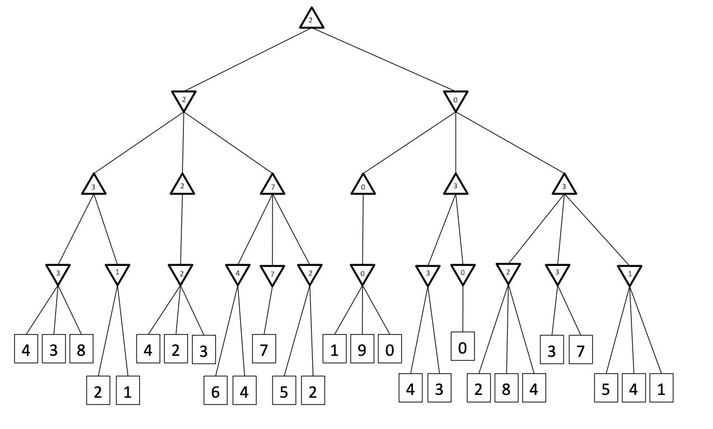
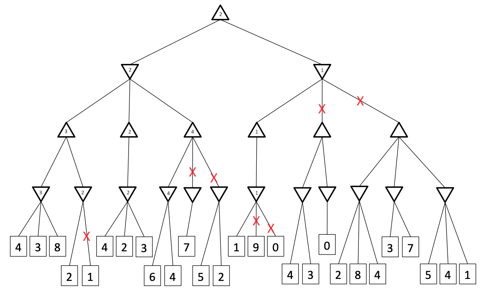

# Questions
1. Give the values calculated by minimax for all states in the tree. Do not use alpha-beta pruning. (2p) I recommend that you print the tree, fill the values and upload a picture with your mobile phone as answer.
   
2. Indicate which branches of the tree will be pruned by alpha-beta pruning. (3p) I recommend that you use the solutions from task 1 as a starting point, mark the branches to prune and upload a picture with your mobile phone as answer.

# Solutions

